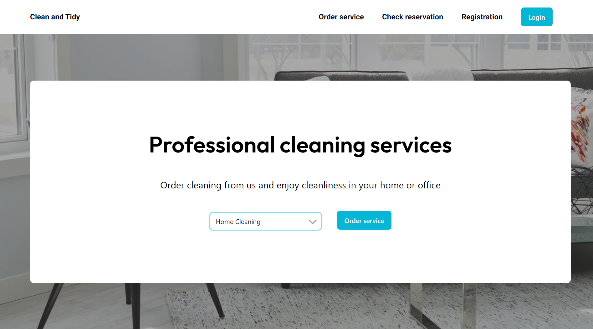
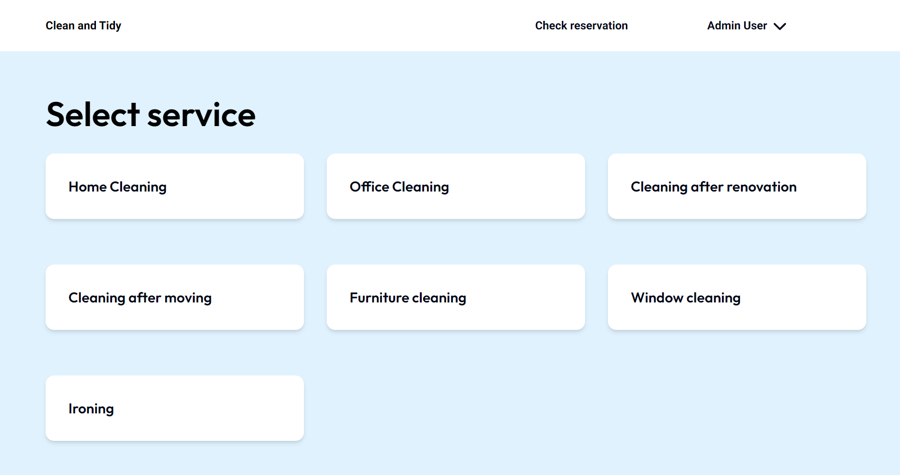
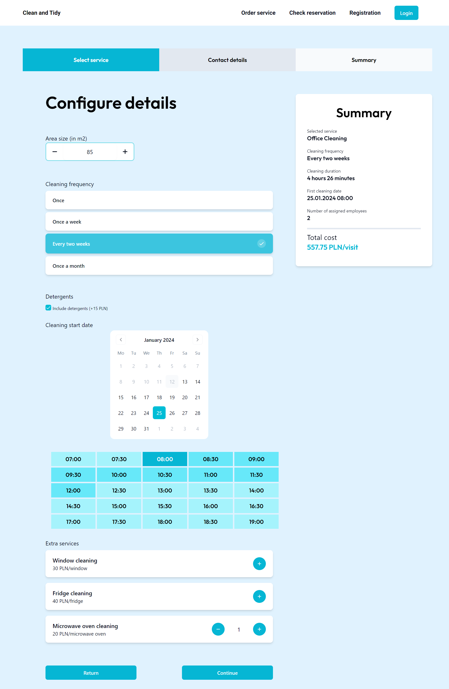
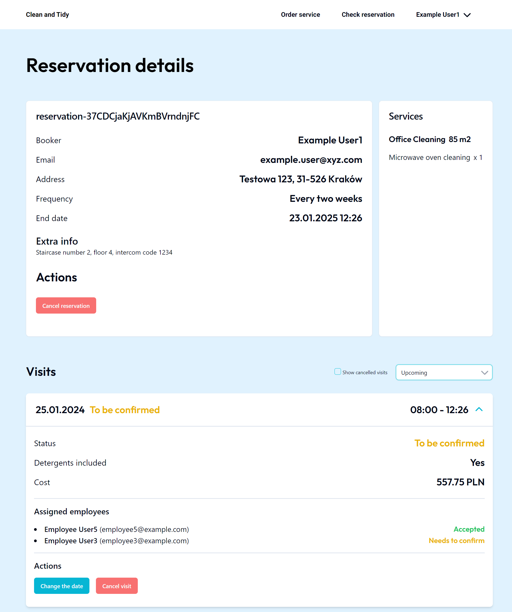
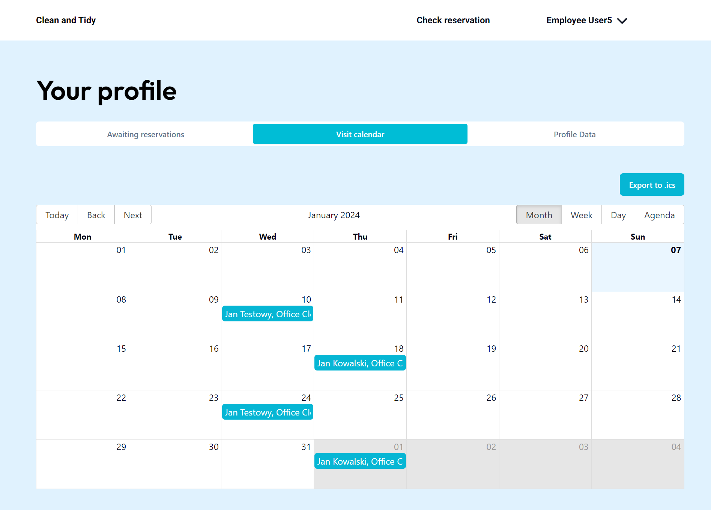
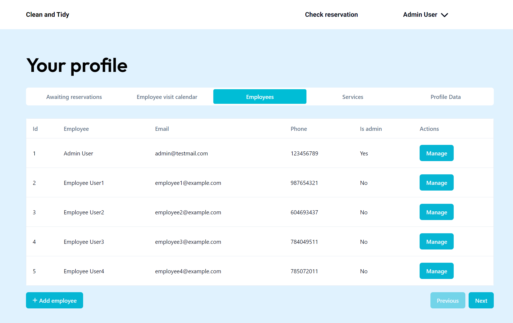
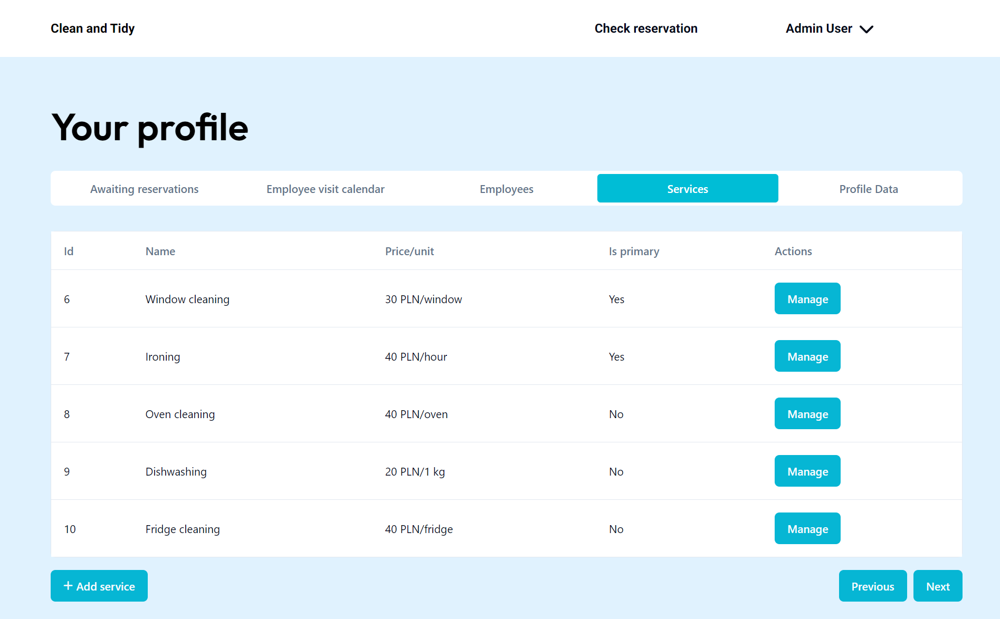

# Clean and Tidy Client

Frontend part of the application for the cleaning company, written in TypeScript, React and Next.js.















## Functionalities

The website provides three roles:

- client,
- employee,
- admin.

As a client, user can order services within reservations - one-time or the recurring ones. One can change the visit date or cancel it if needed.

As an employee, user is able to confirm the user's reservation and cancel an upcoming visit.

As an admin, user is able to create the accounts for regular employees, change their data, create new services and modify existing ones in the reservation system.

## To run the project

First of all, make sure you have the following software installed:

- Node.js >= 18
- pnpm >= 8

1. Create `.env` file with following variables:

- `NEXT_PUBLIC_BACKEND_BASE_URL` - the base URL for the server app.

2. Install libraries

```bash
pnpm install
```

3. Run the app

a) In development mode:

```bash
pnpm dev
```

b) In production mode:

Set the `NODE_ENV` environment variable:

```
NODE_ENV="production"
```

then build:

```bash
pnpm build
```

and run the app:

```bash
pnpm start
```
